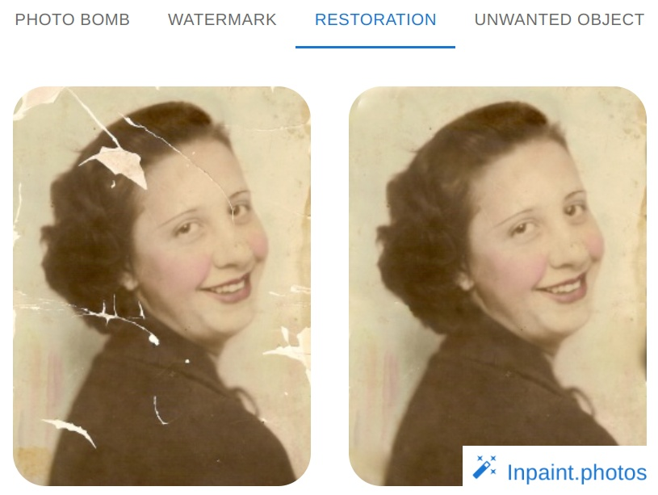

# Add logo to the image



Logo is added to the bottom right of the image.

## Install
```
pip install -U add_logo
```

## Use

```
image_with_logo = add_logo(image, logo, factor)
```

where `image` and `logo` are numpy arrays and `factor` is the target `logo_height` / `image_height`.
